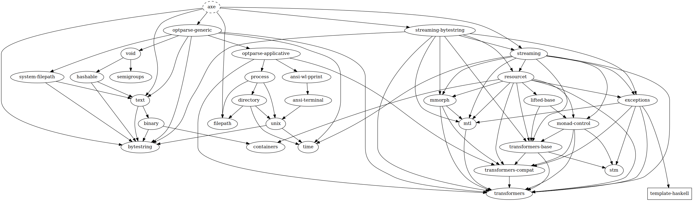

Axe
===

Cut arbitrarily large OSM XML files with no memory overhead.

Installation
------------

```console
> git clone git@github.com:fosskers/axe.git
> cd axe
> stack install
```

Usage
-----

```console
> axe --input /path/to/giant/xml.osm --catalog /path/to/output/catalog/
```

Dependency Graph
----------------


